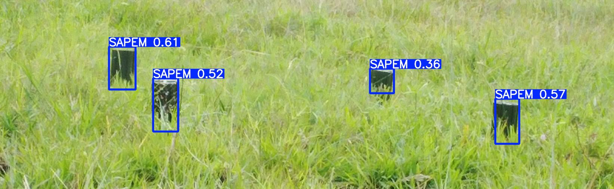

# 🧨 Chinese Landmine Detector (SATM / SAPEM) using YOLOv5 + Gradio

This project is a real-time web application that detects Chinese landmines — **SATM** and **SAPEM** — in aerial or ground-level images using a **custom-trained YOLOv5 object detection model**.

The app is built with **Gradio** for an intuitive interface and allows:
- Instant detection by uploading images
- Viewing results with bounding boxes + confidence scores
- Generating and downloading detection logs in CSV format

---

## 🔗 Live Demo

🎯 Try it here:  
👉 [Hugging Face Space](https://huggingface.co/spaces/OvasProg/landmine-detector)
> 🖼️ Test samples can be found in the `/sample_images/` directory.

---

## 📸 Example Detections

### 🚨 Landmines Detected
  
*Detected SAPEM landmines.*

### ✅ No Landmine Detected
  
*No SATM or SAPEM landmines found.*

> 📂 Images saved under `/runs/detect/` and results copied to `/static/` during app use.

---

## 🛠️ How to Use This Code Locally

### 1. Clone the repository
```bash
git clone https://github.com/your-username/landmine-detector-yolov5-gradio.git
cd landmine-detector-yolov5-gradio
```
### 2. Set up Python environment

It’s recommended to use a virtual environment:
```bash
python -m venv .venv
source .venv/bin/activate  # or .venv\Scripts\activate on Windows
```
### 3. Install requirements

```bash
pip install -r requirements.txt
```
### 4. Run the app

```bash
python app.py
```

Then open http://127.0.0.1:7860 in your browser.

## 🧠 How It Was Built

- Model: Trained using YOLOv5 in Google Colab
- Dataset: Custom-labeled SATM and SAPEM images (sourced and labeled via Roboflow)
- Training: 50 epochs on Google Colab, model saved as best.pt
- Interface: Built with Gradio for easy web app deployment
- Deployment: Hosted on Hugging Face Spaces

## 📄 Features
- 🔍 Detect SATM / SAPEM landmines
- 📷 Upload any image for testing
- 📝 Generate & download logs of detections
- 🧹 Clear previous results easily with one button
- 🌍 Deployable via Hugging Face Spaces

## 🚧 Limitations
-	Model trained on a specific dataset size (~300 images)
-	Detection performance depends on image resolution & angle
-	Only detects SATM and SAPEM — not generalized to all landmines

## 📜 License

MIT License — free to use, modify, and share.
